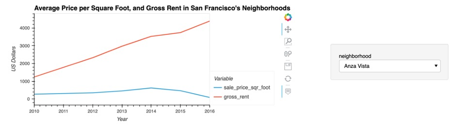
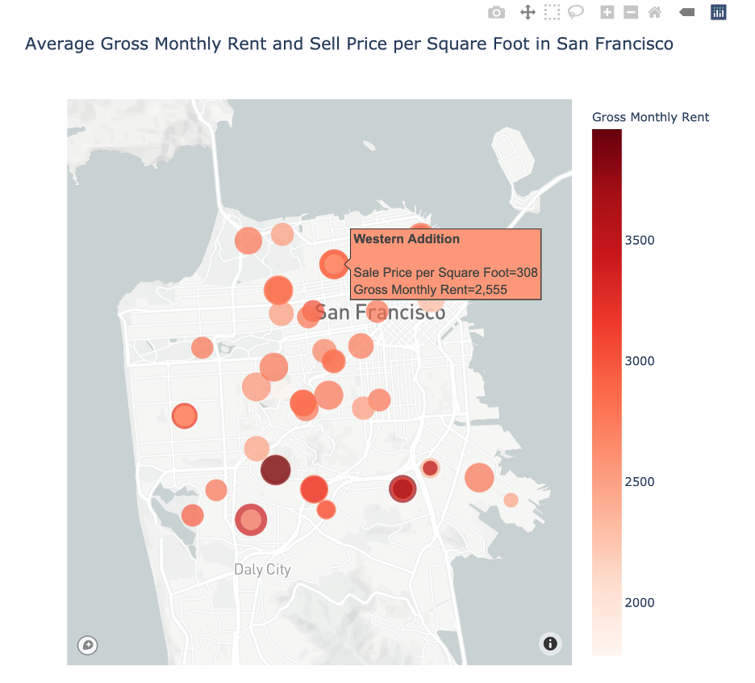

# Housing_Rental_Analysis_for_San_Francisco

This project evaluates the housing market in San Francisco to offer an instant, one-click service for people to buy properties and then rent them. 
We use data visualization, including aggregation, interactive visualizations, and geospatial analysis, to assess properties in the San Francisco market as viable investment opportunities for this business.


## Technologies
For the analysis we use a jupyter notebook, on python, in a PyViz environment ecosystem. We also use the following libraries:
OS, Pandas, Pathlib, and Dotenv for the general calculations and access/management of data.
Plotly Express, Hvplot, and Dash for visualizations.

We uses Maobox API integration wit Plotly Express Library to be able to have visualizataions of geographically based data.


## Instalation Guide
The file is a jupyter notebook. If you don't have jupyter notebook, you can install it following the instruction here:

https://jupyterlab.readthedocs.io/en/stable/getting_started/installation.html

You need to have installed PyViz, with some specific version of Plotly and NodeJS. The version we use for Plotly is 4.13.0; for hvPlot, 0.7.0 or later; and for NodeJS, version 12 or later. Additionally, you need a specific version of Jupyter Lab (2), as well as Jupyter Lab extensions for PyViz and Plotly Express.

If you don't have installed a PyViz ecosystem, you may want to execute the following installations packages from conda, together with the Jupyter Lab dependencies. The version used for Python is 3.7:

```
conda install -c plotly plotly=4.13.
conda install -c pyviz hvplot
conda install -c conda-forge nodejs=12
conda install -c conda-forge jupyterlab=2
jupyter labextension install jupyterlab-plotly@4.13.0 --no-build
jupyter labextension install @jupyter-widgets/jupyterlab-manager plotlywidget@4.13.0 --no-build
jupyter labextension install @pyviz/jupyterlab_pyviz --no-build
jupyter lab build
```

To be able to generate visualizations, you need to have a `.env` file with proper API access token for Mapbox API on the same directory than the notebook. For this purpose you may need to create an account here: https://account.mapbox.com/. You can use the `sample.env` file as a base. You just fill your correcponding MAPBOX_API_ACCESS_TOKEN in the space marked in that sample file, and save the file as `.env`. Notice that the file will became invisible, but will still be there, and it will be accessed by the application.


In case you have issues with your installations, you can try creating a new environment with the necesary tools, with the following installation :

```
conda deactivate
conda install ipykernel -y
conda create -n pyvizenv python=3.7 -y
conda activate pyvizenv
conda install -c conda-forge jupyterlab=2 -y
conda install -c plotly plotly=4.13. -y
conda install -c pyviz hvplot -y
conda install -c conda-forge nodejs=12 -y
conda install streamz -y
pip install python-dotenv decorator==4.3 networkx
conda install nb_conda_kernels ipykernel -y
jupyter labextension install jupyterlab-plotly@4.13.0 --no-build
jupyter labextension install @jupyter-widgets/jupyterlab-manager plotlywidget@4.13.0 --no-build
jupyter labextension install @pyviz/jupyterlab_pyviz --no-build
conda list plotly
conda list hvplot
conda list nodejs
```


### Usage

This is a jupyter notebook with a pre-run code. You can go through it and see code as well as results. 

If you look to reuse the code, and do not have experience on jupyter lab, please refer:
https://www.dataquest.io/blog/jupyter-notebook-tutorial/

Some of the visualizations have some interactions available.

> The visualization for the "Average Price per Square Foot, and Gross Rent in San Francisco's Neighborhoods" has a dropdown at the right that you can use to select a particular neirborhood. For example, below "Anza Vista" neirborhood is chosen.



 > Also, in the "Average Gross Monthly Rent and Sell Price per Square Foot in San Francisco" (screenshot below), you can see in each neirborhood the monthly gross rent and the sale price of every neirborhood by scrolling with the mouse over. As the price per square foot became larger, the size of the circle became larger; as the average rent became pricer, the color became darker. You can explore additional functionalities on the tools on the right top of the map for zoom, selections, savings, and more.




## Contributors
This project was coded by Paola Carvajal Almeida, paola.antonieta@gmail.com.

Contact email: paola.antonieta@gmail.com
LinkedIn profile: https://www.linkedin.com/in/paolacarvajal/


## License
This project uses a MIT license. This license allows you to use the licensed material at your discretion, as long as the original copyright and license are included in your work files. This license does not contain a patent grant,  and liberate the authors of any liability from the use of this code.

